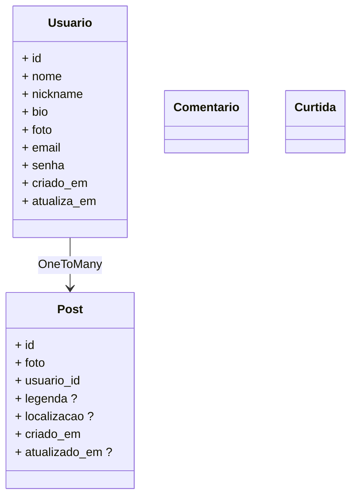

# API do Instagram

## Tecnologias 
- Node
- ExpressJS
- MySQL

### Recursos
- Usuários
- Posts
- Comentários
- Curtidas

### Estruta dos Dados

```mermaid

classDiagram
    Usuario --> Post: OneToMany
    class Usuario {
        + id
        + nome
        + nickname
        + bio
        + foto
        + email
        + senha
        + criado_em
        + atualiza_em
    }

    class Post {
        + id
        + foto
        + usuario_id
        + legenda ?
        + localizacao ?
        + criado_em
        + atualizado_em ?
    }

    class Comentario {
        
    }

    class Curtida {
        
    }

```

https://mermaid.live
